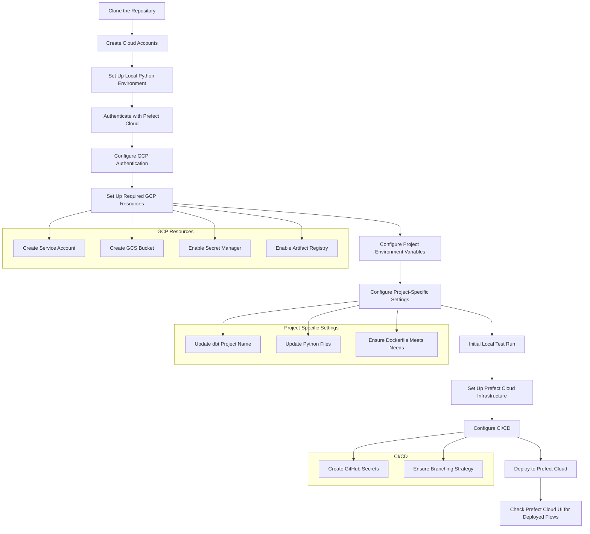

# Parsons + Prefect Cloud Pipeline Template

This template provides a standardized structure for data engineers and activists to build scalable data pipelines using:

- **Parsons** for data connectors to progressive tech tools
- **Prefect** for workflow orchestration in the cloud
- **Google Cloud Platform** for infrastructure
- **dbt** for data transformation
- **Docker** for containerization
- **GitHub Actions** for CI/CD

---



## Configuration Overview

Setting up this pipeline template involves configuring credentials and settings across several services and files. This summary outlines the key areas you'll need to address, with detailed steps following in the main guide:

- **Cloud Platform Accounts:** Creating accounts and enabling services/billing for Prefect Cloud and Google Cloud Platform (GCP).
- **GCP Resources:** Creating and configuring specific GCP resources like Service Accounts (with appropriate roles/permissions), Cloud Storage Buckets, Secret Manager (for storing secrets), and Artifact Registry (for Docker images).
- **Local Development Environment:** Setting up Python (`uv`, virtual environment), configuring local environment variables (like `GOOGLE_APPLICATION_CREDENTIALS`), downloading Docker Desktop, and authenticating Docker with GCP Artifact Registry (`gcloud auth configure-docker`).
- **Project `.env` File:** Populating this file with specific API keys, resource names, project IDs, and file paths required for local execution and connections (e.g., `PREFECT_API_KEY`, `PREFECT_API_URL`, `GCP_PROJECT_ID`, `GAR_LOCATION`, `GAR_REPOSITORY`, `GCS_TEMP_BUCKET`).
- **Project Code Configuration:** Updating project-specific names or settings within files like `dbt/dbt_project.yml` and potentially within Python pipeline files (`pipelines/flows/`).
- **Prefect Cloud Setup:** Logging in via the CLI and configuring Work Pools within the Prefect Cloud UI to manage execution environments.
- **GitHub Repository Settings:** Configuring GitHub Actions Secrets (e.g., `GCP_SA_KEY`, `PREFECT_API_KEY`, `GAR_LOCATION`) to allow automated CI/CD workflows to authenticate and deploy resources.

The detailed step-by-step instructions for each of these areas are provided below.

---

## Getting Fully Set Up: Step-by-Step Guide

This section outlines all the necessary steps to get your project environment, authentication, cloud resources, and CI/CD pipeline fully configured.

**1. Clone the Repository:**

- Obtain a copy of this template project on your local machine.

  ```bash
  # [TODO: Add specific cloning instructions if this is a template repository on GitHub]
  # Example:

  git clone https://github.com/matthewkrausse/parsons-prefect-dbt-cloud-tutorial.git your-project-name

  cd your-project-name
  ```

**2. Create Cloud Accounts:**

- **Prefect Cloud:** Sign up for a free account at [app.prefect.cloud](https://app.prefect.cloud/).
- **Google Cloud Platform (GCP):**
  - Create a new Google Cloud Project if you don't have one already.
  - Ensure billing is enabled for the project if required by the services you intend to use (e.g., BigQuery, Cloud Storage, Secret Manager, Artifact Registry, Cloud Run).

**3. Set Up Local Python Environment:**

- Install `uv`, a fast Python package installer and resolver.
  ```bash
  pip install uv
  ```
- Create and activate a virtual environment.
  ```bash
  uv venv
  source .venv/bin/activate  # On macOS/Linux
  # or .venv\Scripts\activate on Windows
  ```
- The `pyproject.toml` is where we have our project's dependencies and is where `uv` looks to know what to install
- Install project dependencies using `uv`.
  ```bash
  uv sync
  ```

**4. Authenticate with Prefect Cloud:**

- Log in to your Prefect Cloud account from the command line. This will often involve opening a web browser for authentication or using an API key.
  ```bash
  prefect cloud login
  ```

**5. Configure Google Cloud Platform (GCP) Authentication:**

- **Create a Service Account:**
  - In your GCP project, navigate to IAM & Admin > Service Accounts.
  - Create a new service account.
  - Grant the following roles (or more specific ones based on least privilege):
    - `BigQuery Data Editor` (or `BigQuery User` + `BigQuery Job User`)
    - `Storage Object Creator` (for the GCS bucket)
    - `Secret Manager Secret Accessor` (to read secrets)
    - `Artifact Registry Writer` (to push Docker images)
    - `Cloud Run Invoker` / `Cloud Run Admin` (if using Cloud Run for Prefect work pools)
    - _Add any other roles needed by your specific Parsons connectors or GCP interactions._
- **Download Service Account Key:**
  - Create a JSON key for the service account and download it securely to your local machine. **Treat this file like a password.**
- **Set Environment Variable for Local Development:**
  - Make the path to your downloaded JSON key file available via the `GOOGLE_APPLICATION_CREDENTIALS` environment variable. How you set this depends on your OS and shell.
  - _Example (macOS/Linux, temporary for current session):_
    ```bash
    export GOOGLE_APPLICATION_CREDENTIALS="/path/to/your/keyfile.json"
    ```
  - _Note:_ For production/CI/CD, you'll handle this differently (see Step 11).

**6. Set Up Required GCP Resources:**

- **Google Cloud Storage (GCS) Bucket:**
  - Create a GCS bucket. This is often used by BigQuery for loading data or as a temporary storage area.
  - Note the name of this bucket (e.g., `your-gcs-temp-bucket`).
- **Google Secret Manager:**
  - Enable the Secret Manager API in your GCP project.
  - Create secrets for sensitive information your pipelines will need (e.g., API keys for VAN, ActionNetwork, database passwords). You will reference these secret names in your code or configuration.
- **Google Artifact Registry (GAR):**
  - Enable the Artifact Registry API.
  - Create a Docker repository in GAR to store your container images. Note its location (e.g., `us-central1`) and repository name (e.g., `my-pipelines-repo`). The full path will look like: `<location>-docker.pkg.dev/<your-gcp-project-id>/<repository-name>`.

**7. Configure Project Environment Variables (`.env` file):**

- Copy the example environment file:
  ```bash
  cp .env.example .env
  ```
- Edit the `.env` file and fill in the required values:
  - `GOOGLE_APPLICATION_CREDENTIALS`: Path to your service account key file (for local runs if not set globally).
  - `GCS_TEMP_BUCKET`: The name of the GCS bucket you created.
  - `PREFECT_API_KEY`: Your Prefect Cloud API key (alternative to `prefect cloud login`). Get this from your Prefect Cloud profile.
  - `PREFECT_API_URL`: Your Prefect Cloud workspace API URL (e.g., `https://api.prefect.cloud/api/accounts/[ACCOUNT_ID]/workspaces/[WORKSPACE_ID]`).
  - `GCP_PROJECT_ID`: Your Google Cloud Project ID.
  - `GAR_LOCATION`: The location of your Artifact Registry repo (e.g., `us-central1`).
  - `GAR_REPOSITORY`: The name of your Artifact Registry repo (e.g., `my-pipelines-repo`).
  - _Add any other environment variables required by your specific pipelines or dbt connections._
  - **Important:** Ensure `.env` is listed in your `.gitignore` file to prevent accidentally committing secrets.

**8. Configure Project-Specific Settings (Code):**

- **dbt:** Rename the project in `dbt/dbt_project.yml` from the template default to your actual project name.
- **Pipelines:** Update any hardcoded GCP project IDs or resource names in the Python files within `pipelines/flows/` (though using environment variables from `.env` is preferred). Review `example_flow.py` and update lines marked with `"# CHANGE"`.
- **Docker:** Ensure your `Dockerfile` meets your project's needs.

**9. Initial Local Test Run:**

- Run the healthcheck script to verify dependencies are installed correctly.
  ```bash
  python pipelines/flows/healthcheck.py
  # Look for output confirming system information.
  ```
- Run the example flow locally to test connections and basic logic. This run will be tracked in the Prefect Cloud UI.
  ```bash
  python pipelines/flows/example_flow.py
  ```
- Check the [Prefect UI](https://app.prefect.cloud/) to see the results of your local flow run.

**10. Set Up Prefect Cloud Infrastructure (Work Pools):**

- Create work pools in Prefect Cloud to manage the infrastructure where your flows will run when deployed. This template assumes serverless execution (like Google Cloud Run).
- [Follow the steps here to create two work pools, e.g., "prod-cloud-work-pool" and "dev-cloud-work-pool"](https://docs.prefect.io/v3/deploy/infrastructure-examples/serverless). Adjust names as needed, but ensure they match deployment configurations. These work pools will likely point to the Docker image you'll build and push (either locally or via CI/CD).

**11. Configure CI/CD (GitHub Actions Secrets):**

- **GitHub Secrets:** In your GitHub repository, go to `Settings > Secrets and variables > Actions`. Create the following **Repository Secrets**:
  - `GCP_PROJECT_ID`: Your Google Cloud Project ID.
  - `GCP_SA_KEY`: The _entire content_ of your downloaded GCP service account JSON key file.
  - `PREFECT_API_KEY`: Your Prefect Cloud API key.
  - `PREFECT_API_URL`: Your Prefect Cloud workspace API URL.
  - `GOOGLE_CREDENTIALS_DOCKER`: The _entire content_ of your downloaded GCP service account JSON key file (again, often needed specifically for Docker builds within Actions to push to Google Artifact Registry or interact with GCP). _Verify if this duplicate is truly necessary based on your `deploy_flow.yaml` workflow._
  - `GAR_LOCATION`: The location of your Artifact Registry repo (e.g., `us-central1`).
  - `GAR_REPOSITORY`: The name of your Artifact Registry repo (e.g., `my-pipelines-repo`).
- **Branching Strategy:** The CI/CD is often configured to trigger on specific branches (e.g., `dev`, `main`). Ensure your branching strategy aligns with the triggers in `.github/workflows/*.yaml`. The example suggests creating a `dev` branch and opening a Pull Request.

**12. Deploy to Prefect Cloud via CI/CD:**

- Commit your changes (ensure `.env` is gitignored!) and any code modifications.
- Create a branch (e.g., `dev` if that's what your workflow triggers on).
  ```bash
  git checkout -b dev
  git add .
  git commit -m "Initial setup and configuration"
  git push origin dev
  ```
- Open a Pull Request on GitHub from your `dev` branch to your main branch (or as configured in `deploy_flow.yaml`).
- The GitHub Actions workflow (`deploy_flow.yaml`) should automatically trigger. It will typically:
  - Authenticate Docker with Google Artifact Registry.
  - Build a Docker image containing your flow code and dependencies using the `Dockerfile`.
  - Push the Docker image to your specified Google Artifact Registry repository.
  - Run the `pipelines/flows/deploy_flows.py` script, which registers your flows with Prefect Cloud and associates them with the appropriate work pool and image.
- Once the action completes successfully, go to the Prefect Cloud UI. You should see your deployed flows under "Deployments". You can now trigger runs directly from the UI, which will execute using the pushed Docker image on the infrastructure defined by your work pool (e.g., Google Cloud Run).

You have now completed the full setup process!

---

## Building and Pushing the Docker Image Locally (Optional)

While the CI/CD pipeline (`deploy_flow.yaml`) handles building and pushing the Docker image automatically, you might want to do this manually for testing the container environment or for deployments outside the standard CI/CD process.

**Prerequisites:**

- Docker Desktop or Docker Engine installed and running on your local machine.
- Google Cloud CLI (`gcloud`) installed.
- You have completed the GCP setup steps above, including creating a Service Account, enabling Artifact Registry, and creating a repository.

**Steps:**

1.  **Authenticate Docker with Google Artifact Registry (GAR):**
    Configure Docker to use your Google Cloud credentials for authentication with Artifact Registry. Replace `<location>` with your GAR repository's location (e.g., `us-central1`).

    ```bash
    gcloud auth configure-docker <location>-docker.pkg.dev
    ```

    _Note: You might need to log in to gcloud first (`gcloud auth login`) or ensure your environment is using the correct service account (`gcloud auth activate-service-account --key-file=/path/to/your/keyfile.json`)._

2.  **Define Image Name and Tag:**
    Choose a name and tag for your image. It's best practice to include the full GAR path. Replace placeholders accordingly.

    ```bash
    # Ensure these match your .env file or actual values
    export GCP_PROJECT_ID="<your-gcp-project-id>"
    export GAR_LOCATION="<your-gar-location>" # e.g., us-central1
    export GAR_REPOSITORY="<your-gar-repository-name>" # e.g., my-pipelines-repo
    export IMAGE_NAME="<your-image-name>" # e.g., parsons-prefect-pipeline
    export IMAGE_TAG="<your-tag>" # e.g., latest, v1.0, git sha

    export FULL_IMAGE_NAME="${GAR_LOCATION}-docker.pkg.dev/${GCP_PROJECT_ID}/${GAR_REPOSITORY}/${IMAGE_NAME}:${IMAGE_TAG}"
    echo "Building image: ${FULL_IMAGE_NAME}"
    ```

3.  **Build the Docker Image:**
    Run the build command from the root directory of your project (where the `Dockerfile` is located).

    ```bash
    docker build -t "${FULL_IMAGE_NAME}" .
    ```

    _Note: If your Dockerfile needs access to secrets or arguments at build time (less common for Prefect flows, more common for application builds), you might need to use `--build-arg`. For runtime secrets, rely on environment variables or Prefect Blocks/GCP Secret Manager._

4.  **Push the Docker Image to GAR:**
    Once the build is successful, push the image to your Artifact Registry repository.
    ```bash
    docker push "${FULL_IMAGE_NAME}"
    ```

Now the image is available in your Google Artifact Registry repository. You could potentially update a Prefect Deployment manually in the UI to use this specific image tag, or use this image for local testing with Docker.

---

## What is Parsons?

[Parsons](https://github.com/move-coop/parsons) is an open-source Python package that provides connectors to dozens of data sources and tools used in the progressive data ecosystem, including:

- **VAN/EveryAction**
- **ActionNetwork**
- **ActBlue**
- **Redshift/Postgres/MySQL** databases
- **Google Sheets and BigQuery**
- **And many more!**

## Project Structure

```
project/
├── dbt/                        # Data modeling with dbt
│   ├── models/                 # SQL transformation models
│   └── dbt_project.yml         # dbt project configuration
├── pipelines/                  # Prefect data pipelines
│   ├── flows/                  # Workflow definitions
│   └── deploy_flows.py         # Flow deployment script
├── tests/                      # Unit and integration tests
├── .github/workflows/          # CI/CD pipeline configurations
├── Dockerfile                  # Container configuration
├── pyproject.toml              # Python dependencies
├── .env.example                # Environment variables template
└── README.md                   # Project documentation
```

## Using dbt (optional)

I added a dbt folder in here for transformations.
You can configure it to create a model of the dataset we just created in BQ.
But you never have to use it.

```bash
cd dbt
dbt deps         # Install package dependencies
dbt run          # Run all models
dbt test         # Run all tests
```

## Deploying with CI/CD

The template includes GitHub Actions workflows:

- `deploy_flow.yaml`: Build/deploy Prefect flows
- `dbt_run.yml`: Build/test dbt models on PRs
- `dbt_hourly.yml`: Scheduled dbt runs

Required GitHub Secrets:

- GCP_PROJECT_ID
- GCP_SA_KEY
- PREFECT_API_KEY
- PREFECT_API_URL
- GOOGLE_CREDENTIALS_DOCKER

## Customization Guide

1. **Project Configuration**

   - Update project name in `dbt_project.yml`
   - Set your GCP project ID in pipeline files
   - Configure database/data warehouse connections

2. **Data Sources**

   - Define your sources in `dbt/models/sources.yml`
   - Create appropriate staging models

3. **Pipelines**

   - Customize flow files in `pipelines/flows/`
   - Update deployment configuration as needed
   - The deployments are configured to take any flow, add it to the flows to deply and then loop through them.

4. **CI/CD**

   - Adjust GitHub Actions workflows based on your needs
   - Configure proper triggers and schedules

5. **Testing**
   - Add unit and integration tests in the `tests/` directory
   - Use pytest or other testing frameworks
   - Ensure coverage for critical components

## Best Practices

- Name models and pipelines consistently
- Document data lineage and transformations
- Follow a clear pattern for directory structure
- Use environment variables for sensitive information
- Test your models to ensure data quality
